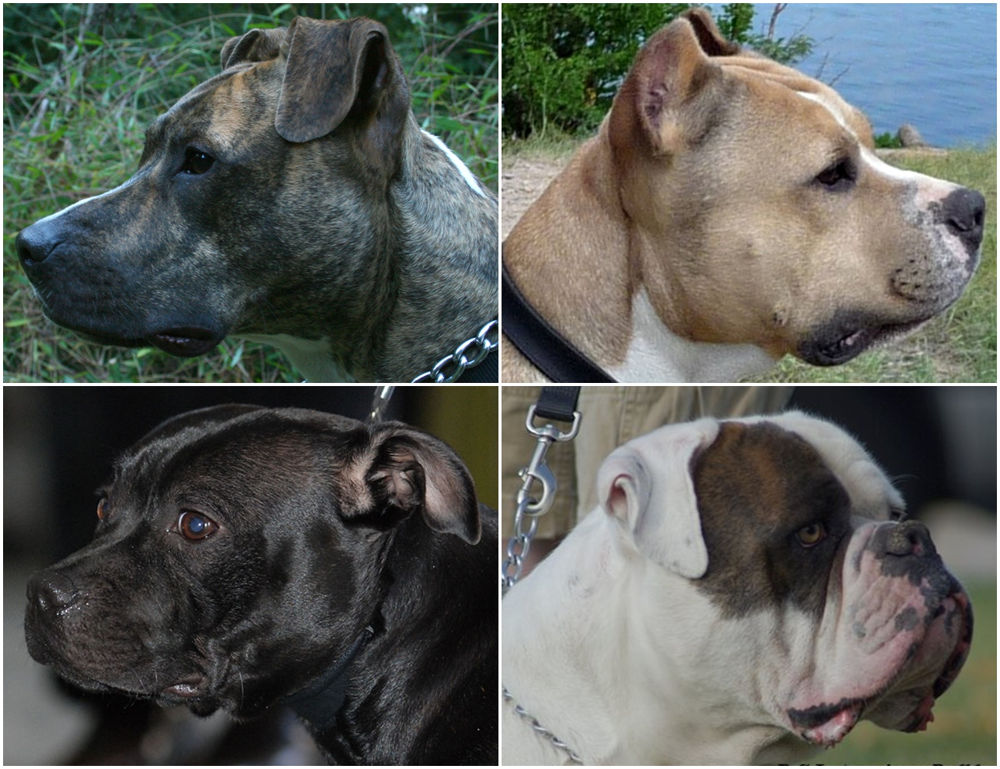

# Test Doc with artifacts

## dogs


> This is a <em>very long</em> line that will still be quoted properly when it wraps. Oh boy let's keep writing to make sure this is long enough to actually wrap for everyone. Oh, you can into a blockquote. 

```json
{
    "test":"attribute",
    "Hope":"It works!"
}
```




